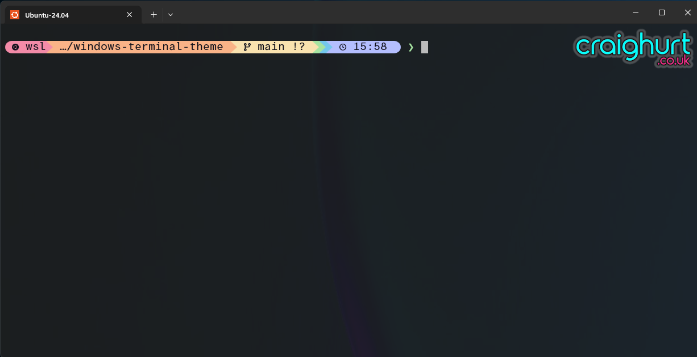

# windows-terminal-theme

A branded theme for the new Windows terminal!



## Installation

- From Windows terminal, select `Settings` and  click `Open JSON file` (located in the bottom left of the window).
- Add the `theme.json` contents into the `schemes` array:

```
{
  ...
    "schemes": 
    [
      <add theme here>
    ]
    ...
}
```

- Save the changes.  The `CraigHurt-Dark` theme should now be availble for selection with your terminal of choice!

### Adding the logo

To use the logo, change the `Background Image` section (on the `Appearance` configuration) as follows:

- Backround image path: Path to the `craighurt_terminal.png` file
- Background image strech mode: None
- Background image alignment: Top Right
- Background image opactiy: 100%

## Additional Tools

- We love [Starship](https://starship.rs/) for that extra prompt goodness
- Pair this with a [Nerd Font](https://www.nerdfonts.com/) of your choice to complete the look
